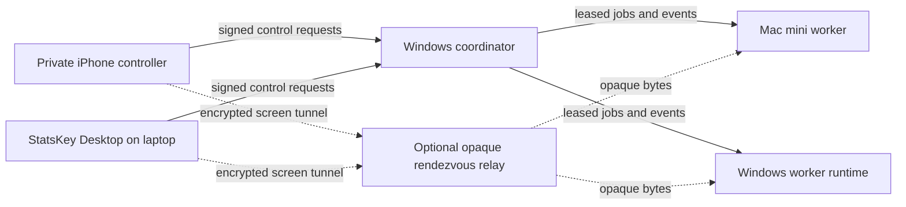

# StatsKey multi-device orchestration

Status: implementation architecture  
Initial owner: one trusted StatsKey account  
Product direction: tenant-ready, general-purpose Workspace + Fleet + Jobs  
Last verified: 2026-08-19

## Outcome

StatsKey Desktop remains a general-purpose local workspace. It also becomes a
controller for enrolled execution nodes:

- the laptop is the primary controller and only becomes a worker for an
  explicitly active streamed workspace;
- the Mac mini is an unattended macOS worker for agent tasks, Xcode builds,
  tests, archives, and approved release preparation;
- the Windows 11 Pro server is an unattended worker and the preferred durable
  coordinator for the owner's private fleet;
- a private iPhone controller can start, steer, review, approve, cancel, and
  observe work, then open an authenticated remote screen to the Mac mini or
  Windows server;
- physical phones are controllers or development targets, never general
  remotely controlled workers.

Machines contribute CPU, memory, storage, simulators, and installed tools by
running separate jobs. Ordinary agent runtimes do not combine multiple
machines' RAM into one process. A lead run decomposes work, assigns independent
jobs, and reconciles results and test evidence.

## Non-negotiable boundaries

1. No shared unrestricted shell.
2. No ambient trust from being on the same network.
3. No cloud service can decrypt remote screen or input traffic.
4. No job may address a filesystem path outside an enrolled workspace.
5. No two write jobs share a mutable checkout by default.
6. No lease means no execution.
7. A stale lease holder cannot publish events, artifacts, or results.
8. App Store upload, Git publication, destructive filesystem work, credential
   use, and external communications retain exact review boundaries.
9. The Windows coordinator and the nutrition/fitness backend failover are
   separate trust domains even when hosted on the same hardware.
10. Workspace live sync remains optional. It is not the default transport for
    agent jobs.

## Topology



The normal data path is direct over LAN, a user VPN, or a reachable private
endpoint. When NAT prevents a direct path, an optional relay forwards
end-to-end encrypted frames. The relay is a routing aid, not an authority and
not a source of device trust.

The coordinator persists small control records and event metadata. Workspace
snapshots and large artifacts use content-addressed object storage chosen by
the owner. The current Workbench database can provide a portable hosted
control-plane adapter, but the protocol must also run against the Windows
coordinator without Firebase-specific semantics.

## Components

### StatsKey Controller

The existing desktop renderer gains two product surfaces:

- **Fleet** — enrolled devices, presence, capabilities, resource pressure,
  active grants, connection path, software version, and attention states.
- **Jobs** — task graph, assignments, live events, logs, artifacts, approvals,
  budgets, cancellation, retries, and reconciliation.

The existing Workspace remains the editor. Choosing a remote execution
location changes where file, terminal, Git, agent, build, and test operations
run; it does not turn Fleet into a separate product.

### StatsKey Node

Each worker runs a signed supervisor:

- Windows: native Windows service supervising versioned native, WSL2, or
  container workloads.
- macOS: signed launch daemon plus a signed-in worker helper for Xcode,
  Keychain-mediated actions, screen capture, and Accessibility-mediated input.

The supervisor owns pairing keys, connection recovery, leases, resource
telemetry, child-process containment, log framing, cancellation, and upgrades.
Agent runtimes are adapters beneath it, never network daemons of their own.

### Private iPhone controller

The first phone surface is a separate private/TestFlight controller rather
than a public feature in the nutrition/fitness app. It supports:

- start, steer, pause, resume, and cancel;
- live status, logs, diffs, tests, and artifacts;
- biometric approval for protected actions;
- completion, failure, drift, and budget notifications;
- tunneled macOS Screen Sharing/VNC and Windows RDP sessions.

The phone does not expose a remote-control listener.

### Coordinator

The Windows coordinator is durable when the laptop is closed. It owns:

- device registry and public keys;
- pairing challenges and revocation;
- job DAGs and idempotency;
- capability grants;
- queue ordering and deadlines;
- resource leases and heartbeats;
- append-only job events;
- artifact manifests;
- notification intents;
- audit receipts.

It never stores a reusable plaintext worker credential. Device private keys
remain hardware-backed where the platform supports it.

## Device identity and pairing

Every installation creates an asymmetric device key:

- Secure Enclave/Keychain on Apple platforms;
- TPM/CNG on Windows;
- platform keystore on Android if it later becomes a controller.

Pairing requires all of:

1. authenticated StatsKey account;
2. QR or short-code challenge displayed by an already trusted device;
3. proof of possession for the new device key;
4. explicit assignment of controller, worker, or hybrid role;
5. a bounded initial capability set.

Pairing records expire and are single-use. Device certificates are
short-lived, renewable, and revocable. Account recovery does not silently
restore unattended control; at least one trusted device or a separately stored
recovery key is required.

## Capability model

Capabilities are small named scopes:

- `workspace.read`
- `workspace.snapshot`
- `workspace.write`
- `terminal.run`
- `git.inspect`
- `git.mutate`
- `git.publish`
- `agent.statskey`
- `agent.claude-code`
- `agent.cursor`
- `xcode.build`
- `xcode.test`
- `xcode.archive`
- `appstore.upload`
- `windows.build`
- `service.host`
- `screen.view`
- `screen.input`
- `device.inspect`
- `device.mutate`

A device advertises support; a grant authorizes use; a job requests the
minimum intersection. Advertised support alone is never permission.

Policy profiles are selectable rather than hard-coded:

- **Review every action**
- **Apply reversible workspace work automatically**
- **Work independently with protected boundaries**
- **Custom per-capability policy**

Standing grants are device-, workspace-, capability-, and policy-version
bound. They may expire. Remote screen input always starts a visible session;
unattended access requires a separately issued controller grant and biometric
unlock.

## Workspace execution models

### Default: target-local Git snapshot

1. Resolve an exact repository and commit.
2. Reject ambiguous or dirty source unless the user explicitly creates a
   content-addressed snapshot.
3. Create a detached task worktree on the target.
4. Assign every job a unique worktree, DerivedData directory, temp directory,
   and artifact directory.
5. Return patches, commits, artifacts, and test evidence.
6. Reconcile into the user's workspace only after review and conflict checks.

### Explicit snapshot transfer

Uncommitted work is packaged as a bounded manifest:

- base commit;
- normalized relative paths;
- content hashes and blobs;
- executable bit;
- deletions;
- ignored/skipped paths;
- creator device and signature.

The target materializes the snapshot in a task worktree. It never applies
directly over an unrelated dirty checkout.

### Optional live sync

The existing Workspace Sync engine is suitable for an explicitly linked,
human-owned workspace. It remains an edge-case convenience for handoff and
co-editing. Agent jobs still receive isolated snapshots so a bidirectional
sync conflict cannot silently become an execution result.

### Shared and cloud volumes

Network and cloud volumes may host artifacts or caches. They are not the
default mutable source checkout because disconnects, filesystem semantics,
watcher loss, and latency make safe concurrency harder.

## Job protocol

### Job envelope

Every job includes:

- immutable owner and job ID;
- schema and policy version;
- objective and task type;
- workspace snapshot reference;
- required capabilities;
- target selector;
- resource request;
- dependency IDs;
- deadline and maximum attempts;
- approval and reconciliation policies;
- optional cage policy;
- idempotency key;
- creation and update timestamps.

Free-form prompts are bounded data. They cannot add capabilities, change the
workspace, extend a deadline, or increase a budget.

### State machine

```text
queued
  -> leased
  -> preparing
  -> running
  -> needs_review | waiting
  -> running
  -> succeeded | failed | cancelled | timed_out
```

Terminal states are immutable. Cancellation is monotonic. A worker may return
`preparing` or `running` work to `queued` only when it reports a retryable
failure and confirms that no process remains. The coordinator releases the
lease and resources atomically, and the next claim creates a new bounded
attempt. Expired leases for work that reached `running` fail closed because the
execution outcome is ambiguous; they are never replayed automatically. A
transition operation ID is digest-bound to the owner, worker, job, lease,
attempt, target state, and retry metadata. Exact replays return the original
result even after a later attempt starts; altered replays conflict.

### Leases

A lease binds:

- job and attempt;
- worker device;
- workspace/resource keys;
- random nonce;
- issue, heartbeat, and expiration timestamps;
- coordinator revision.

Only the current lease nonce may publish events or artifacts. Workers stop
work when renewal fails beyond a short grace period. Xcode simulators,
DerivedData locations, repositories, GPUs, and service ports can each have
independent resource leases.

### Events

Workers emit an append-only sequence:

- accepted;
- preparation progress;
- process start/exit;
- structured log chunk;
- test suite/case result;
- artifact published;
- approval requested/resolved;
- budget update;
- checkpoint;
- result;
- failure;
- cancellation acknowledged.

The coordinator rejects duplicate sequence numbers with different payload
digests and rejects events from stale leases.

## Scheduling

Eligibility is fail-closed:

1. worker is paired, active, and recently seen;
2. software and protocol versions are compatible;
3. the coordinator has accepted any platform-required execution authority;
4. required capabilities are both advertised and granted;
5. workspace policy allows the worker;
6. requested CPU, memory, disk, GPU, simulator, and toolchain are available;
7. no exclusive resource lease conflicts;
8. deadline and optional cage allow dispatch.

Protocol v1 has no Linux execution-service attestation, so the coordinator
unconditionally strips self-reported Linux executable capabilities, refuses
Linux claims with `execution-attestation-missing`, and refuses Linux lease
renewal. This duplicates the official client's Ubuntu worker gate at the
server boundary so a custom enrolled client cannot bypass it.

Ranking then favors:

1. explicit device choice;
2. local availability of the repository snapshot and caches;
3. requested toolchain;
4. Mac mini or Windows worker role;
5. lower active load and sufficient free memory/disk;
6. direct connection over relay;
7. laptop only when the user opted its active workspace into local execution.

The scheduler benchmarks the Mac mini before setting Xcode concurrency. It
starts with one build/test lane and raises concurrency only when memory,
simulator, disk, and thermal evidence remain healthy.

## Agent adapters and reconciliation

Initial adapters:

- StatsKey intelligent agent;
- approved shell/build commands;
- Xcode build, test, archive, and simulator actions;
- Claude Code;
- Cursor SDK/CLI or hosted-agent handoff.

Each adapter normalizes start, input, streaming events, steering, cancellation,
exit, usage, and artifacts. Provider-specific session IDs remain opaque.

Default reconciliation is lead-directed:

1. decompose the objective into non-overlapping tasks;
2. dispatch independent worktrees;
3. collect patches, claims, tests, and artifacts;
4. reject changes outside each assignment;
5. detect overlapping paths and incompatible assumptions;
6. apply compatible changes in dependency order;
7. run aggregate verification;
8. request review for conflicts or protected publication.

Manual branch review, best-of-N, and adaptive best-of-N are alternate policies.

## Optional cage

The cage is an opt-in policy, not the default execution mode. Its limits are a
loose guardrail and must not cancel a nearly complete job merely because one
heuristic fired.

Inputs can include:

- provider spend and token ceilings;
- wall-clock and idle deadlines;
- tool-call and retry limits;
- CPU, memory, GPU, disk, and network ceilings;
- allowed paths, hosts, tools, models, and child jobs;
- repeated-failure and no-progress windows;
- objective-drift signals.

Possible decisions:

- continue;
- continue but stop spawning work;
- reduce model/fan-out;
- checkpoint and ask;
- pause;
- cancel immediately for a hard safety violation.

Soft limits consider completion evidence and estimated remaining work. Hard
security boundaries never become soft because a job is almost finished.

## Remote desktop

The first implementation tunnels native protocols:

- macOS Screen Sharing/VNC on the Mac mini;
- RDP on Windows 11 Pro.

The StatsKey Node opens no public VNC/RDP port. A control session authorizes a
short-lived loopback/private tunnel bound to one controller device and one
session. The iPhone and desktop controllers implement the client side.

Later, native ScreenCaptureKit/Desktop Duplication capture and a custom
WebRTC/QUIC stream can replace native protocols where latency, clipboard,
multi-monitor, or audit requirements justify it.

Default audit stores session metadata and security-relevant actions, not video.
Recording can be enabled per session with explicit retention and encryption.

## App Store emergency path

An approved unattended Mac mini job may:

- materialize an exact source snapshot;
- edit within its task worktree;
- run tests;
- build and archive using an approved local signing identity;
- produce release notes and verification evidence.

Upload, submission, phased release, and public release remain separate
capabilities. The recommended default is exact biometric review before upload
or submission. Raw signing keys and App Store credentials are never sent to a
controller or model; a local credential broker performs an allowlisted action.

## Nutrition/fitness backend failover boundary

The Windows server may also host a warm backup for the StatsKey iOS, Android,
and web product, but this is a separate program:

- Functions/APIs -> versioned containers behind a provider-neutral gateway;
- Firestore -> canonical event/API writes plus replicated query projections;
- Storage -> content-addressed object replication;
- Auth -> provider-neutral session abstraction and an alternate OIDC service;
- Remote Config -> signed configuration service;
- App Check -> direct App Attest/DeviceCheck and Play Integrity verification;
- push -> direct APNs plus FCM while standard Android background delivery still
  depends on it;
- observability -> self-hosted logs, metrics, traces, and crash ingestion.

The first target is warm failover: service within 15 minutes and no more than
five minutes of data loss. Manual activation with a tested runbook precedes
automatic failover.

Client dual-write is excluded. New server-authoritative operations pass through
a provider-neutral event gateway; existing direct Firebase paths are migrated
incrementally. Sensitive health fields use versioned application-layer
envelopes only where backup computation does not require plaintext. This keeps
the encryption model evolvable instead of forcing either all-server-readable
or unusable full end-to-end encryption.

## Delivery sequence

### Milestone 1A — protocol and local simulation

- shared validation contracts;
- device capability model;
- job state machine, events, deadlines, idempotency, and leases;
- scheduler and optional cage decisions;
- fake coordinator and worker conformance tests.

### Milestone 1B — Windows coordinator and workers

- signed Windows supervisor service;
- Mac mini worker helper;
- direct encrypted connection;
- target-local Git worktrees and snapshot transfer;
- shell, Xcode, StatsKey, Claude Code, and Cursor adapters;
- Fleet and Jobs surfaces.

### Milestone 1C — private iPhone controller and remote screen

- private controller app;
- biometric protected approvals;
- job/log/diff/artifact views;
- notifications;
- tunneled RDP and macOS Screen Sharing/VNC.

Milestone 1 is complete only when all three subphases work end to end.

### Milestone 2 — relay, recovery, and customer-ready enrollment

- opaque rendezvous/relay fallback;
- QR pairing and hardware-key renewal/revocation;
- coordinator backup and restore;
- signed self-update;
- user-selectable review policies;
- tenant and organization boundaries.

### Milestone 3 — nutrition/fitness warm backup

- provider-neutral gateway;
- data/object replication;
- alternate identity/configuration services;
- manual failover runbook;
- recovery and data-integrity drills;
- gradual client support.

## Integration seams

Reuse without changing its authority:

- `desktop/workspace-binding-runtime.cjs`
- `desktop/workspace-checkpoint-runtime.cjs`
- `desktop/terminal-runtime.cjs`
- `desktop/device-control-runtime.cjs`
- `desktop/git-runtime.cjs`
- `desktop/provider-run-guard.cjs`
- `desktop/approval-policy.cjs`
- `src/app/lib/sync/**` for optional human workspace sync

New modules should begin independently:

- `desktop/fleet-runtime.cjs`
- `desktop/fleet-runtime.test.cjs`
- `src/app/lib/fleet/**`
- `workbench-backend/functions/fleet.js`
- `workbench-backend/functions/fleet.test.js`

Current implementation checkpoint:

- the protocol runtime, Workbench persistence/API, Fleet/Jobs surfaces, device
  and grant lists, worker/non-authoritative-controller revocation, grant
  revocation, queued deadline/dependency recovery, bounded poll pagination,
  and worker-restart
  recovery of its own expired leases are wired and tested; a bounded
  once-per-minute coordinator sweep recovers dead-worker leases and expired
  queued jobs; revoking or expiring a grant prevents the next active-lease
  renewal and a definitive renewal denial aborts the local process immediately.
  During a coordinator outage, each worker independently aborts at its last
  acknowledged lease expiry so stale work cannot run indefinitely;
- the first-controller bootstrap requires account authentication plus Ed25519
  key-possession proof, and node requests use short-lived payload-bound
  signatures with transactional replay fences instead of bearer tokens;
  Firestore TTL is configured on fence expiry timestamps. Bootstrap, recovery,
  and pairing now preflight coordinator trust configuration before mutating the
  account trust root;
- emergency controller recovery requires account authentication no more than
  ten minutes old plus replacement-key proof; one transaction revokes the old
  key, installs the replacement, moves the owner trust root, and consumes the
  proof. Grant authorization now checks the issuing controller at poll, claim,
  renewal, event, and transition time, so old grants and leases lose authority
  immediately without a bulk rewrite. The authoritative controller can
  explicitly replace its local key first, stopping its supervisor and
  persisting a new unenrolled key so same-computer compromise recovery does not
  require deleting app data by hand;
- subsequent workers require one exact receipt signed by both the candidate and
  an already trusted controller; device creation and the initial bounded grant
  commit atomically with both replay fences;
- local activation additionally requires a signed `device.status` check against
  the build-pinned Workbench device endpoint, matching owner, device id, and key
  fingerprint;
- an outbound HTTPS node client and the heartbeat/poll/claim/lease/event/
  transition/artifact device API run through cross-runtime tests. Every
  coordinator response is Ed25519-signed over the result and exact request
  identity. Enrollment obtains the public key through the account-authenticated
  API, verifies the first response, and persists the pin; unsigned, tampered,
  expired, wrong-key, and wrong-request responses fail closed. Revoked or
  signature-invalid nodes pause instead of polling indefinitely, transient
  startup outages retry with bounded exponential backoff, and the end-to-end
  path leases a job, starts a real bounded child process, emits ordered events,
  and reaches a terminal state without storing the lease nonce. Response
  validity is checked against receipt time, and lease cancellation is forwarded
  into active coordinator requests so a cancelled assignment does not continue
  transport retries;
- Every immutable job snapshot requires a short-lived signature from an active
  controller. Before signing, the main process normalizes the job and discloses
  the complete bounded objective, command arguments or Xcode options, working
  directory, timeout, targets, resources, policies, and source identity in the
  native prompt; jobs too large for complete native review fail closed. The
  coordinator binds the authorizing controller to both the job and the grant,
  and preflights the exact signed claim response before changing attempts,
  leases, or capacity;
- Xcode build/test/archive and allowlisted command adapters materialize exact
  Git commits; Xcode result, archive, and DerivedData paths are per lease, Git
  credentials are excluded from job-process environments. Every Git, Xcode,
  packaging, and command process must be launched behind a kernel-backed
  authority owner with a distinct security principal. The current Windows
  PowerShell/C#
  owner starts the process suspended in a kill-on-close Job Object, watches the
  exact Electron parent handle, and independently enforces an HMAC-authenticated
  lease fence plus the process/job deadline. It also holds an exclusive owner
  lock, preventing a restarted desktop from spawning work before an older owner
  has finished containment. It proves lifecycle behavior, but because it shares
  the desktop user's token, a hostile workload can inspect or interfere with
  its authority. Packaged Windows workers therefore remain disabled until a
  separately privileged signed service owns the Job Object. The POSIX owner/reaper can enforce
  those deadlines for one process group but cannot contain a child that creates
  a new session. Packaged POSIX workers therefore advertise no executable job
  capabilities and fail before spawn; restoring macOS Xcode execution requires a
  separately reviewed privileged service or equivalent kernel-backed boundary.
  The best-effort POSIX owner now reopens and authenticates an atomically
  replaced lease fence within a bounded check; replacement churn is never
  treated as valid authority by itself. This remains lifecycle hardening, not
  containment. The current arbitrary-executable POSIX owner request must never
  become a root or setuid API. A future service accepts only typed,
  coordinator-signed execution profiles and starts one fixed runner after a
  distinct unprivileged job principal and non-delegated cgroup are installed.
  For a single-owner trusted macOS machine, an unpackaged development build may
  opt into the best-effort owner with
  `STATSKEY_FLEET_ALLOW_BEST_EFFORT_POSIX_OWNER=1`; the flag is ignored by
  packaged builds, never applies to Linux, and does not change the
  coordinator's platform fences.
  Xcode, packaging, and command processes receive per-assignment home, temp,
  config, and cache roots. Git materialization uses the same roots and receives
  only the SSH agent socket rather than ambient home/config or provider-token
  variables. System/user Git configuration, credential helpers, URL rewrites,
  and HTTP redirects are disabled. This narrows ambient state but is not an OS
  privilege boundary.
  Advertised executables are resolved to real paths once per supervisor instead
  of being looked up again through a mutable `PATH` at launch time. Script-only
  Windows launchers are not advertised as directly executable. Before any
  preparation can spawn a process, the desktop fsyncs both an active-job marker
  bound to the OS boot identity and the initial lease-authority fence. It clears
  them only after confirmed process settlement; an app crash therefore blocks
  restart execution until reboot.
  Assignment directories are removed after confirmed terminal outcomes,
  partial preparation is removed only when process termination is known, and
  abandoned directories older than 24 hours are pruned opportunistically. If
  process-tree termination cannot be confirmed, cleanup is withheld and the
  active marker is promoted to a durable worker quarantine for the rest of the
  current system boot;
- successful Xcode work packages `.xcresult` evidence (and `.xcarchive` output
  for archive jobs), reserves a server-derived object key, and uploads at most
  1 GiB through a 30-minute V4 grant pinned to length, GCS-computed MD5,
  worker-reported SHA-256 metadata, media type, and generation zero. It commits
  only while its lease and grant remain current.
  The worker aborts an in-flight upload at grant expiry, and cleanup waits
  beyond that expiry before deleting incomplete manifests, preventing a
  still-valid or still-streaming grant from recreating an orphan object.
  Commit links each retained artifact into the job in the same transaction, so
  evidence remains discoverable even if the worker loses the later event
  acknowledgement. Per-attempt reservation count and byte budgets bound storage
  exposure even for abandoned grants. A deletion lease makes cleanup
  crash-recoverable, and committed evidence expires after 30 days. A bounded
  one-time document-ID backfill also reclaims pre-retention ready manifests
  whose expiration field was omitted.
  Uploads have independent attempt deadlines and bounded retries using the same
  reservation. If publication still fails, the packaged archive is handed to a
  private local spool with an atomic checksum manifest. Hashing and each upload
  read from one pinned file handle, so pathname replacement cannot switch the
  published bytes after reservation. Spool traversal rejects symlink-root
  replacement, opens checksum inputs without following symlinks, avoids
  recursive deletion, and is bounded to 32 entries, seven days, and 16 GiB; the
  Fleet UI surfaces retained evidence for checksum-verified reveal or explicit
  deletion.
  Owner downloads are five-minute grants pinned to the committed object
  generation and capped by retention; no new grant is issued during the final
  five minutes. Desktop downloads are revalidated in the main process and do
  not navigate the app window to the signed bearer URL. The
  `FLEET_ARTIFACT_BUCKET` parameter and IAM/lifecycle contract are defined, but
  the dedicated bucket and three pinned least-privilege runtime service
  accounts have not been provisioned or deployed;
- unattended execution requires a current policy-version-1 unattended grant and
  an `auto` or `independent` job policy. `review` and `custom` jobs remain
  ineligible until a per-job approval-token protocol exists;
- the launcher derives available job types from live device capabilities, so
  agent, reconcile, service, and remote-session jobs are not presented as
  runnable before their adapters exist; desktop heartbeats now advertise Xcode
  and command/build capabilities only in development after finding the
  corresponding local executables and lifecycle owner. Consequently, current
  packaged macOS, Windows, and Ubuntu builds advertise no executable Fleet
  work. The coordinator independently strips Linux executable telemetry,
  rejects Linux claims and renewals, and permits a preexisting Linux lease only
  to transition to an authority-reducing failed, cancelled, or timed-out state;
- the Fleet client still reaches the control plane only through the
  authenticated Workbench API, never through direct Firestore access;
- device keys are currently exportable Ed25519 keys encrypted by Electron
  `safeStorage`; the product calls them OS-protected, not hardware-backed;
- the current supervisor lives inside StatsKey Desktop and therefore runs only
  while the app process runs. A signed Windows service/macOS daemon, dedicated
  low-privilege execution account or container, provisioned response-signing
  key plus overlapping rotation procedure, provisioned evidence bucket, and
  StatsKey/Claude Code/Cursor adapters remain required before calling Milestone
  1B unattended or production-ready.
