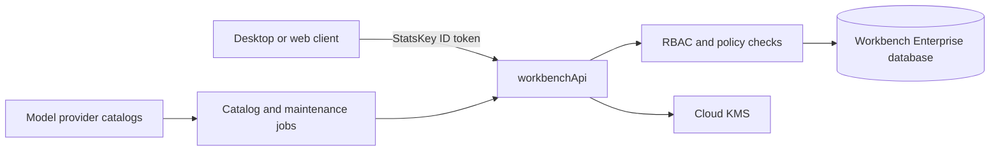

# StatsKey Workbench cloud database schema — draft v2

Status: architecture draft, not a deployed contract  
Target: `projects/statskey-workbench/databases/workbench`  
Verified: 2026-08-18 — Enterprise edition, Firestore Native mode, `nam5`

## Boundary

The Workbench database should remain an operational control plane. Existing
health, nutrition, social, subscription, and profile records stay in the
`statskey` project and keep their current paths and security contracts.

The browser must not access this named database directly. `workbenchApi`
authenticates a StatsKey Firebase ID token and uses the Admin SDK. Firestore
Rules remain default-deny; authorization, validation, idempotency, and field
limits are enforced again in the API because Admin SDK writes bypass Rules.



## Existing paths to preserve

- `githubWorkspaceDeviceFlows/{uid}` — short-lived OAuth device flow state.
- `githubWorkspaceSecrets/{uid}` — encrypted GitHub credential material.
- `githubWorkspaceConnections/{uid}` — non-secret connection status.
- `users/{uid}/githubWorkspaceCommits/{commitSha}` — commit receipts.
- `rateLimits/{hashedUidAndAction}` — server-owned throttling state.

Do not rename these in the first migration. New writes can be dual-written into
the v2 collections before any reader changes.

## Core v2 collections

### `principals/{uid}`

Minimal Workbench identity projection. Do not copy health data, email bodies, or
provider credentials here.

```jsonc
{
  "status": "active",
  "defaultOrganizationId": null,
  "createdAt": "timestamp",
  "updatedAt": "timestamp",
  "schemaVersion": 2
}
```

Subcollections:

- `memberships/{organizationId}` — server-assigned role and lifecycle.
- `devices/{deviceId}` — public device identity, attestation state, last seen;
  never a private key.
- `preferences/current` — cloud-syncable Workbench preferences only. Local
  Execute permission remains local authority; this record may retain an audit
  receipt but cannot grant desktop access.

### `organizations/{organizationId}`

```jsonc
{
  "name": "string <= 120",
  "status": "active | suspended | deleted",
  "ownerUid": "immutable uid",
  "createdAt": "timestamp",
  "updatedAt": "timestamp",
  "schemaVersion": 2
}
```

Subcollections:

- `members/{uid}` — role, status, invitedBy, createdAt, updatedAt.
- `policies/current` — server-authored limits and enabled capabilities.

Clients must never be able to assign or change their own role. Role changes are
server operations with an audit event.

### `workspaces/{workspaceId}`

```jsonc
{
  "organizationId": "nullable immutable id",
  "ownerUid": "immutable uid",
  "label": "string <= 160",
  "kind": "local | cloud | repository",
  "status": "active | archived | deleted",
  "repository": {
    "provider": "github | cursor | other",
    "connectionId": "nullable id",
    "remoteSlug": "non-secret string <= 240"
  },
  "createdAt": "timestamp",
  "updatedAt": "timestamp",
  "schemaVersion": 2
}
```

Subcollections:

- `members/{uid}` — workspace-specific role; cannot exceed organization role.
- `checkpoints/{checkpointId}` — metadata and content-addressed artifact refs.
- `connections/{connectionId}` — non-secret provider metadata and status.

Local absolute paths do not belong in cloud records. Store a stable local
workspace ID and resolve it to a path only in the encrypted desktop store.

### `agentRuns/{runId}`

One immutable execution envelope per user request. Large transcripts and binary
artifacts live in object storage; Firestore stores bounded summaries and refs.

```jsonc
{
  "ownerUid": "immutable uid",
  "organizationId": "nullable id",
  "workspaceId": "nullable id",
  "sessionId": "string <= 128",
  "mode": "ask | plan | debug | agent",
  "taskExpectation": "answer | workspace-change | external-action",
  "modelCatalogId": "provider:model:variant",
  "modelSnapshot": {
    "provider": "openai",
    "modelId": "gpt-5.6-sol",
    "serviceTier": "fast",
    "reasoningEffort": "max"
  },
  "approvalSnapshot": {
    "mode": "review | auto | everything",
    "deviceId": "nullable id",
    "recordedAt": "timestamp"
  },
  "status": "queued | running | needs_input | completed | failed | stopped",
  "terminalReason": "nullable bounded code",
  "createdAt": "timestamp",
  "startedAt": "nullable timestamp",
  "finishedAt": "nullable timestamp",
  "updatedAt": "timestamp",
  "schemaVersion": 2
}
```

Subcollections:

- `steps/{stepId}` — sequence, tool class, bounded input hash, status, timing,
  result receipt, error code, and redacted preview. Never store raw secrets.
- `artifacts/{artifactId}` — object-storage URI, digest, media type, size,
  retention class, and creator step.
- `steering/{messageId}` — bounded user steering captured during the run.

Run status transitions are server-controlled and monotonic. A unique
`sequence` per run makes replay and UI ordering deterministic.

### `actionReceipts/{receiptId}`

Append-only proof for terminal, Git, browser, app, device, hook, and connected
tool actions. This is evidence, not a cloud permission grant.

Required fields: `ownerUid`, `runId`, `stepId`, `actionKind`, `targetHash`,
`idempotencyKey`, `status`, `startedAt`, `finishedAt`, `resultDigest`,
`redactionVersion`, and `schemaVersion`.

Do not store command output indefinitely. Keep a bounded redacted excerpt in
Firestore and put encrypted full output in object storage only when required.

### `modelCatalog/{catalogId}`

Use a stable ID such as `openai:gpt-5.6-sol:fast`. Provider discovery and
managed availability are separate states.

```jsonc
{
  "provider": "openai",
  "modelId": "gpt-5.6-sol",
  "variant": "fast",
  "displayName": "GPT-5.6 Sol Max Fast",
  "status": "candidate | active | deprecated | blocked",
  "discoveredAt": "timestamp",
  "lastSeenAt": "timestamp",
  "providerCreatedAt": "nullable timestamp",
  "capabilities": {
    "textGeneration": true,
    "toolCalling": true,
    "reasoning": true,
    "visionInput": true,
    "maxContextTokens": 1050000,
    "effortOptions": ["low", "medium", "high", "xhigh", "max"]
  },
  "directAvailable": true,
  "managedEnabled": true,
  "serviceTier": "fast",
  "pricing": {
    "currency": "USD",
    "unitTokens": 1000000,
    "input": 10,
    "cachedInput": 1,
    "output": 60,
    "effectiveFrom": "timestamp",
    "effectiveThrough": "nullable timestamp",
    "sourceUrl": "https URL",
    "verifiedAt": "timestamp"
  },
  "catalogRevision": 1,
  "updatedAt": "timestamp",
  "schemaVersion": 2
}
```

Subcollections:

- `pricingHistory/{effectiveFrom}` — immutable historical rate snapshots.
- `probes/{probeId}` — capability test result, latency, route, and redacted
  failure code.

Automatic catalog pipeline:

1. Scheduled jobs call each provider's authenticated model-list endpoint.
2. New generation-capable IDs are inserted as `candidate` and become
   `directAvailable` after a safe capability check.
3. Embedding, media-only, moderation, and realtime-only IDs are filtered out.
4. A provider pricing source is fetched and normalized into a dated snapshot.
5. `managedEnabled` stays false until the backend route, metering, cost ceiling,
   and tool loop pass probes. Discovery alone must never expose an unmetered
   managed route.
6. Clients receive a signed, revisioned catalog response and retain the bundled
   catalog as an offline fallback.

This lets newly released provider models appear automatically for connected
user keys while keeping managed billing deliberate and testable.

### `usageLedger/{entryId}`

Immutable, idempotent accounting entries. Never update a prior entry to correct
it; append a compensating entry.

Required fields: `ownerUid`, optional `organizationId`, `runId`, `provider`,
`modelCatalogId`, input/cached/output token counts, provider cost micros,
managed credit delta, currency, provider request ID hash, `occurredAt`,
`recordedAt`, and `schemaVersion`.

Derived rollups live in `usageAggregates/{scopeAndPeriod}` and can be rebuilt
from the ledger.

### Operational collections

- `jobs/{jobId}` — scheduled catalog sync, cleanup, export, and migration work
  with leases, attempts, and dead-letter state.
- `idempotencyKeys/{keyHash}` — owner, operation, request digest, response ref,
  expiration, and state.
- `auditEvents/{eventId}` — append-only actor, action, target, outcome, policy
  revision, timestamp, and bounded metadata.
- `schemaMigrations/{migrationId}` — state, cursor, counts, started/finished
  timestamps, and immutable code revision.
- `serviceHealth/{serviceId}` — last successful probe and current catalog
  revision; no secrets or user content.

## Secrets

Keep encrypted secrets in dedicated server-only documents, separate from
listable connection metadata. Use envelope encryption with Cloud KMS, include
`keyVersion`, rotate by writing a new ciphertext, and never log plaintext.

Suggested paths:

- `secretEnvelopes/{secretId}` — ciphertext, key version, owner, purpose,
  createdAt, rotatedAt.
- Connection documents retain only `secretId`, provider, status, scopes, and
  timestamps.

## Query-driven Enterprise indexes

Enterprise edition currently has no indexes, so add only indexes required by
real API queries:

- `agentRuns`: `ownerUid ASC, updatedAt DESC`
- `agentRuns`: `workspaceId ASC, updatedAt DESC`
- `agentRuns`: `organizationId ASC, status ASC, updatedAt DESC`
- collection group `steps`: `status ASC, finishedAt DESC`
- `modelCatalog`: `status ASC, provider ASC, displayName ASC`
- `modelCatalog`: `directAvailable ASC, lastSeenAt DESC`
- `usageLedger`: `ownerUid ASC, occurredAt DESC`
- `usageLedger`: `organizationId ASC, occurredAt DESC`
- `jobs`: `status ASC, availableAt ASC`
- `auditEvents`: `organizationId ASC, occurredAt DESC`

Validate each definition against the exact API `where` and `orderBy` clauses
before adding it to `firestore.indexes.json`.

## Retention and limits

- Device flow records: TTL after 15 minutes.
- Idempotency keys: TTL after 24 hours unless the operation needs a longer
  replay window.
- Raw run output artifacts: configurable 7–30 days; durable user artifacts are
  promoted explicitly.
- Action receipts and audit events: 13 months by default, subject to enterprise
  policy.
- Rate-limit windows and job leases: TTL immediately after their recovery
  window.
- Every free-text Firestore field gets a strict byte/character limit. Keep each
  document comfortably below Firestore's 1 MiB limit.

## Migration sequence

1. Add API validators and write-path tests; do not change existing readers.
2. Create v2 collections and query-specific indexes.
3. Dual-write GitHub connection and commit receipts with idempotency keys.
4. Backfill in bounded jobs and compare counts/digests.
5. Enable v2 reads behind a server flag, then stop legacy writes.
6. Retain legacy records through a rollback window before cleanup.

Before production rollout, enable delete protection and point-in-time recovery
for the `workbench` database, then test restore procedures. Both protections
were still disabled when reverified through the Firebase CLI on 2026-08-19.
The target is the `nam5` Enterprise, Firestore Native database.
